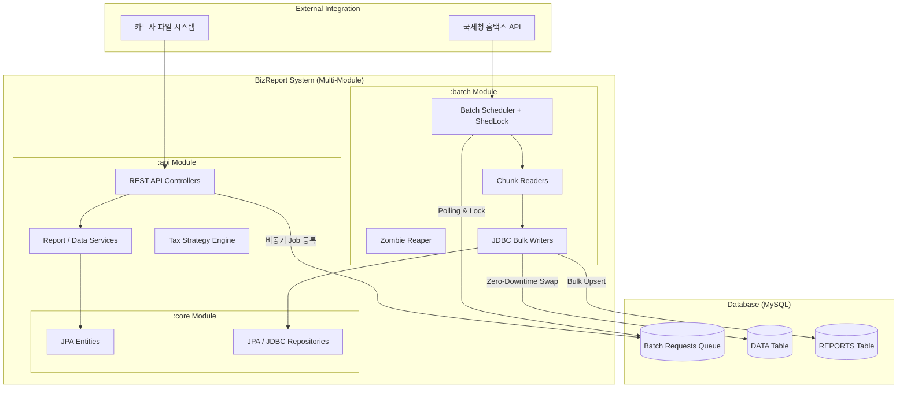

# BizReport - 소상공인 맞춤형 세금 예측 리포트

> **"복잡한 세무 지식을 코드로 추상화하여, 소상공인의 세금 불안을 해소합니다."** 
>  
> 실무 경험을 바탕으로 기획/개발한 백엔드 시스템입니다.

 

---

## 1. Project Overview
- **기획 배경:** 소상공인들은 매일 발생하는 결제 데이터 속에서 당월 예상 부가세와 종합소득세를 파악하기 어렵습니다.
- **핵심 목표:** 
  1. 관심사 분리: CORE, API, BATCH 멀티 모듈 기반으로 시스템 결합도를 낮추고 확장을 용이하게 합니다.
  2. 안정한 대용량 처리: Event-Driven(비동기 대기열) 및 Time-Driven(스케줄링) 기반의 분산 배치 처리를 구현합니다.
  3. 데이터 정합성: 무중단 데이터 스왑(Swap), 멱등성 보장(Upsert), 선분 이력 관리(SCD Type2)를 통해 어떠한 장애 상황에서도 세무 데이터의 무결성을 유지합니다.

 

---

## 2. Tech Stack
- **Language:** Java 17
- **Framework:** Spring Boot 3.2.4
- **Architecture**: Gradle Multi-Module (:api, :batch, :core)
- **Data Access:** Spring Data JPA, Querydsl 5.0, Spring JDBC (Bulk Insert/Update)
- **Batch Processing:** Spring Batch 5, ShedLock (Distributed Lock)
- **Database:** MySQL 8.0, H2 (Test)
- **Monitoring & API:** Jaeger (Distributed Tracing)
- **Infra:** Docker & Docker Compose

 

---

## 3. System Architecture

 

---

## 4. Batch Architecture
### 4.1. Event-Driven vs Time-Driven 스케줄링 분리
- Time-Driven (예약형 배치): updateJob(분기별 국세청 동기화), closedJob(매일 자동 폐업 전환), reportJob(매월 세금 리포트 생성) 등 정해진 시간에 동작하며 ShedLock을 통해 다중 서버 환경에서 중복 실행을 방지합니다.
- Event-Driven (요청형 비동기 배치): cardJob, rateJob 등 사용자의 대용량 CSV 업로드 요청 시, WAS 스레드를 점유하지 않고 batch_requests (대기열 DB)에 상태(READY)를 저장합니다. 이후 스케줄러가 큐를 Polling하여 비동기로 처리합니다.

### 4.2. 장애 복구 및 무중단 파이프라인
- 좀비 리퍼 (Zombie Reaper) 패턴: 서버 크래시(OOM 등)로 인해 상태가 PROCESSING에 영원히 멈춰버린 좀비 큐를 감지하고, 일정 시간 경과 시 READY로 롤백하여 타 서버가 재시도(Self-Healing)할 수 있도록 자가 복구 매커니즘을 구현했습니다.
- 무중단 스왑 (Zero-Downtime Swap): 사용자가 대용량 카드 내역을 덮어쓰기 할 때, 기존 데이터를 바로 DELETE하지 않습니다. 동적 임시 테이블(TEMP_DATA)을 생성해 적재한 후, 원본 테이블의 특정 카드 내역만 타겟팅하여 트랜잭션 내에서 안전하게 Swap 처리하여 Dirty Read와 데이터 유실을 원천 차단합니다.

 

---

## 5. Core Domain & Business Logic
### 5.1. Single Source of Truth (단일 데이터 원천)
- 부가세(VAT)와 종합소득세(CIT)는 동일한 DATA 엔티티를 공유합니다.
- 세금 종류별로 데이터를 중복 적재하지 않고, TaxCalculator 인터페이스를 통한 전략 패턴(Strategy Pattern)을 적용하여 같은 데이터를 읽어 서로 다른 산출 로직(과세유형, 신고타입)을 적용합니다.

### 5.2. 멱등성 보장 및 리포트 마감 시스템
- 산출된 세금 리포트는 ON DUPLICATE KEY UPDATE를 활용한 Bulk Upsert로 DB에 적재되어, 배치를 여러 번 재실행해도 멱등성(Idempotency)이 보장됩니다.
- 리포트는 법정 마감 기한 전까지는 지속적으로 재계산 및 업데이트가 가능하며, 기한이 지난 후에는 수정이 불가능하도록 상태를 잠금(Lock) 처리합니다.
- 복잡한 세금 계산 근거는 정규화로 인한 조인(Join) 성능 저하를 막기 위해 JSON 컬럼(tax_calc)으로 직렬화하여 저장합니다.

### 5.3. 선분 이력을 통한 상태 관리 (SCD Type 2)
- 사업자의 과세유형(일반/간이) 또는 영업상태가 변경될 경우, 기존 레코드를 UPDATE하지 않고 BIZ_HISTORY 테이블에 새로운 이력을 INSERT합니다.
- 기존 이력의 tax_type_end_dt를 닫아주고 새로운 이력을 9999-12-31로 활성화하는 SCD(Slowly Changing Dimension) Type 2 방식을 적용하여, 과거 특정 시점의 세율을 정확히 추적하여 세금을 계산합니다.

 

---

## 6. Out of Scope (구현 제외 범위)
- **면세사업자 대상 로직 제외:** 부가세 과세사업자(일반/간이)의 세금 예측 파이프라인에 개발 역량을 집중하여 도메인 복잡도를 통제했습니다.
- **상세 세액 공제/감면 특례 적용 제외:** 코어 비즈니스 로직(표준 세액 계산 및 대용량 배치 처리) 검증에 집중하기 위해 잉여 복잡성을 배제했습니다.
- **공인인증서 기반 스크래핑 제외:** 실제 외부 시스템(홈택스)의 불안정성 및 인프라 종속성을 탈피하기 위해 Mock 데이터 제너레이터(DataService.generate)로 대체했습니다. 

 

---

## 7. Troubleshooting
### 7.1. 대용량 카드 내역 업로드 시 중복 방지 및 무중단 스왑(Swap) 아키텍처 고도화
사용자가 동일한 기간의 카드 내역(CSV)을 재업로드할 때 발생하는 데이터 중복 문제를 해결하는 과정에서, 시스템 안정성과 데이터 무결성을 보장하기 위해 아키텍처를 3단계에 걸쳐 고도화했습니다.

- Phase 1. DB Unique Key 제약 조건 (도입 보류)
  - 접근: 초기에는 카드번호 + 결제일시 등에 Unique Key(UK)를 걸어 DB 단에서 중복을 차단하려 했습니다.
  - 한계: 수만 건의 대용량 데이터를 JdbcBatchItemWriter로 Bulk Insert 하는 환경에서, 단 하나의 중복 레코드 때문에 전체 Chunk 단위가 Rollback 되는 문제가 발생했습니다. 예외 처리(Skip) 로직이 복잡해지고 쓰기 성능이 크게 저하되어 다른 방식을 모색했습니다.
- Phase 2. 타겟팅 Delete-and-Insert (데이터 유실 위험 발견)
  - 접근: 업로드 API의 파라미터로 카드번호와 조회 기간(startDt, endDt)을 명시적으로 받아, 해당 범위의 기존 데이터를 DELETE 한 후 새 데이터를 INSERT 하는 덮어쓰기 방식으로 변경했습니다.
  - 한계 (Fatal Risk): 만약 DELETE 쿼리가 실행된 직후 서버 크래시(OOM, DB Connection Timeout 등)가 발생하여 배치가 중단된다면? 기존 데이터는 삭제되고 새 데이터는 적재되지 않는 치명적인 데이터 유실(Data Wipeout) 현상이 발생할 수 있음을 깨달았습니다.
- Phase 3. 동적 임시 테이블(Staging Table)을 활용한 Zero-Downtime Swap (최종 해결)
  - 해결: 데이터 유실을 원천 차단하고 원자성(Atomicity)을 보장하기 위해 Staging 패턴을 도입했습니다.
    1. 사용자의 요청 ID를 기반으로 동적 격리 테이블(TEMP_DATA_XXX)을 생성합니다.
    2. Spring Batch의 Chunk 프로세스를 통해 CSV 데이터를 원본 테이블이 아닌 임시 테이블에 안전하게 모두 적재합니다.
    3. 적재가 100% 완료된 후, 마지막 Tasklet Step에서 단일 트랜잭션으로 타겟 원본 데이터 삭제 -> 임시 테이블 데이터 복사(INSERT INTO ... SELECT ...) -> 임시 테이블 파기를 수행합니다.
  - 성과: 업로드 도중 어떤 장애가 발생하더라도 원본 DATA 테이블은 전혀 타격을 받지 않으며, 사용자는 덮어쓰기 작업 중에도 기존 데이터로 안전하게 세금 리포트를 조회할 수 있는 무중단(Zero-Downtime) 환경을 구축했습니다.

 

---

## 8. API Documentation
- 추가예정

 

---

## 9. Testing
- 추가예정
