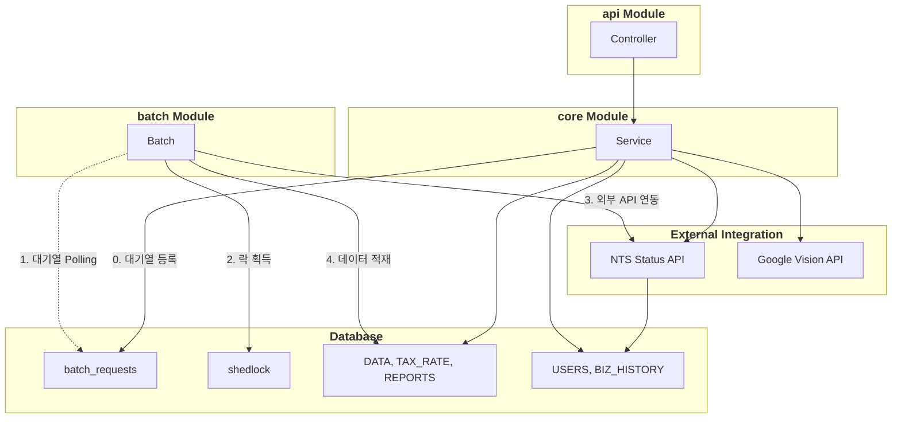
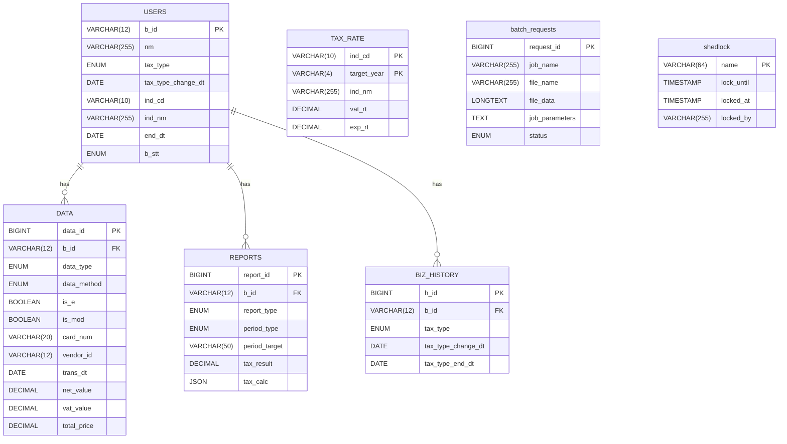

# BizReport - 소상공인 맞춤형 세금 예측 리포트

> **"복잡한 세무 지식을 코드로 추상화하여, 소상공인의 세금 불안을 해소합니다."** 
> <br/>
> 실무 경험을 바탕으로 기획/개발한 백엔드 시스템입니다.

<br>
> [BizReport 세무 도메인 가이드 보러가기](https://github.com/solkim7612/BizReport/wiki/Domain-Knowledge)
<br/>

---

## 1. Project Overview
- **기획 배경:** 소상공인들은 매일 발생하는 결제 데이터 속에서 실시간 예상 부가세와 종합소득세를 파악하기 어려움
- **핵심 목표:**
  - 멀티 모듈 구조: 모듈 분리를 통한 관심사 분리 및 확장성 확보 
  - 안정한 대용량 처리: 비동기 대기열 및 스케줄링 기반의 정교한 배치 파이프라인 구현 
  - 데이터 정합성: 무중단 스왑, 멱등성 보장, 선분 이력 관리를 통해 세무 데이터 신뢰성 확보

<br/>

---

## 2. Tech Stack
- **Language:** Java 17
- **Framework:** Spring Boot 3.2.4
- **Architecture**: Gradle Multi-Module (:api, :batch, :core)
- **Data Access:** Spring Data JPA, Querydsl 5.0, Spring JDBC (Bulk Upsert)
- **Batch Processing:** Spring Batch 5, ShedLock (Distributed Lock)
- **Database:** MySQL 8.0
- **Infra:** Docker

<br/>

---

## 3. System Architecture



<br/>

---

## 4. ERD



<br/>

---

## 5. 주요 기능 및 기술적 의사결정
### 5.1. 무중단 데이터 교체 (Zero-Downtime Swap)
- 기술: Dynamic Staging Table 패턴
- 근거
  - 원본 데이터를 직접 조작 시 데이터 유실 위험이 크며, 작업 중에는 서비스 조회 불가능
  - 동적 임시 테이블에 선적재 후 트랜잭션 내에서 원본 테이블과 swap 하는 전략을 통해 원자성을 확보하고, 적재 중에도 무중단 조회가 가능

### 5.2. 고성능 Bulk 작업과 멱등성 보장
- 기술: JdbcBatchItemWriter & ON DUPLICATE KEY UPDATE
- 근거
  - 대용량 데이터 적재 시 JPA의 영속성 컨텍스트를 사용하면 메모리 오버헤드와 다량의 Insert 쿼리로 인한 성능 저하가 발생함
  - Spring JDBC 기반의 Bulk 연산을 통해 성능을 최적화하고, 외부 요인으로 인한 배치 재실행 시 발생하는 PK 중복 문제를 Upsert 전략으로 해결하여 복잡한 로직 없이 DB 레벨에서 시스템 멱등성을 보장함

### 5.3. 시점 추적을 위한 이력 관리 (SCD Type 2)
- 기술: Effective Date Tracking (tax_type_change_dt ~ tax_type_end_dt)
- 근거
  - 기존 레코드를 Update 방식은 과거의 과세유형(일반/간이)를 소실시켜, 소급 세액 계산이나 특정 시점 데이터 추적이 불가능함
  - BIZ_HISTORY 테이블을 활용하여 변경 이력을 분리 관리하고 유효기간을 설정함으로써, 과거 특정 시점의 세무 상태를 소급하여 정확히 재계산할 수 있는 도메인 무결성을 확보 

### 5.4. 이벤트 기반 부하 분산 (Event-Driven Architecture)
- 기술: Database-based Queue & Polling Scheduler (with ShedLock)
- 근거
  - 대용량 적재 요청을 동기적으로 실시간 처리하면 WAS의 스레드 자원이 고갈되어 응답 지연 발생
  - 사용자 요청을 batch_requests 테이블에 격리하여 비동기로 처리하고, ShedLock을 통해 분산 환경에서 다중 인스턴스의 배치 중복 실행을 원천 차단함

<br/>

---

## 6. Out of Scope (구현 제외 범위)
- **면세사업자 대상 로직 제외:** 부가세 과세사업자(일반/간이)의 세금 예측 파이프라인에 개발 역량을 집중하여 도메인 복잡도를 낮춤
- **상세 세액 공제/감면 특례 적용 제외:** 코어 비즈니스 로직(표준 세액 계산 및 대용량 배치 처리) 검증에 집중하기 위해 잉여 복잡성을 배제
- **공인인증서 기반 스크래핑 제외:** 실제 외부 시스템(홈택스)의 불안정성 및 인프라 종속성을 탈피하기 위해 Mock 데이터 제너레이터(DataService.generate)로 대체 

<br/>

---

## 7. API Documentation
```text
BizReport/
└── docs/               
    └── postman/
        └── BizReport_API_Collection.json
```

| 분류 | 기능               | Method | URL | 설명                       |
| :--- |:-----------------| :--- | :--- |:-------------------------|
| Business | 사업자 등록           | POST | /api/v1/business | 신규 사업자 등록                |
| Business | 사업자 정보 수정        | PATCH | /api/v1/business/{id} | 기존 사업자 정보 변경             |
| Business | 업종별 세율 업로드       | POST | /api/v1/business/upload/rate | 배치 대기열에 등록               |
| Data | 영수증 텍스트 추출 (OCR) | POST | /api/v1/data/receipt/extract | 이미지 기반 세무 데이터 추출         |
| Data | 수기 데이터 생성        | POST | /api/v1/data | 개별 수기 세무 데이터 입력          |
| Data | 데이터 조회           | GET | /api/v1/data/{id} | 기간/유형별 세무 데이터 조회         |
| Data | 데이터 금액 수정        | PATCH | /api/v1/data/{id} | 수정 가능한 데이터 금액 변경         |
| Data | 데이터 삭제           | DELETE | /api/v1/data/{id} | 마감기한이 지나지 않은 데이터 삭제      |
| Data | 더미 데이터 생성        | POST | /api/v1/data/generate/mock | 홈택스 스크래핑 대체              |
| Data | 업로드 양식 다운로드      | GET | /api/v1/data/download/format | CSV 샘플 다운로드              |
| Data | 카드 내역 업로드        | POST | /api/v1/data/upload/card | 배치 대기열에 등록               |
| Report | 기간 리포트 생성        | POST | /api/v1/reports/batch/accumulated | 원하는 기간 리포트 생성 요청         |
| Report | 리포트 조회           | GET | /api/v1/reports/view/{id} | 월별/기간별 세금 리포트 조회         |
| Batch | 배치 대기열 시작        | POST | /api/v1/batch/queue/run | 대기 중인 배치 큐 즉시 실행         |
| Batch | 지난 세율 정리         | POST | /api/v1/batch/rate/delete | 5년 이상 지난 세율 데이터 삭제       |
| Batch | 사업자 상태 동기화       | POST | /api/v1/batch/status/update | 국세청 API 기반 사업자 상태 갱신     |
| Batch | 사업자 상태 폐업 전환     | POST | /api/v1/batch/status/closed | 폐업일이 지난 사업자 폐업 상태로 일괄 전환 |
| Batch | 데이터 마감           | POST | /api/v1/batch/data/closed | 신고 마감기한이 지난 세무 데이터 마감    |
| Batch | 월간 리포트 생성        | POST | /api/v1/batch/report/monthly | 당월 예상 세액 리포트 생성          |
| Batch | 기간 리포트 생성        | POST | /api/v1/batch/report/accumulated | 분기별 누적 예상 세액 리포트 생성      |
| Batch | 캐시 초기화           | POST | /api/v1/batch/cache/clear | 업종명 및 세율 캐시 초기화          |


<br/>

---

## 8. Troubleshooting
### 8.1. 대용량 카드 내역 업로드 성능 및 안정성 확보
사용자가 동일한 기간의 같은 카드 내역을 재업로드할 때 발생하는 데이터 중복 문제를 해결하는 과정에서, 시스템 안정성과 데이터 무결성을 보장하기 위해 아키텍처를 3단계에 걸쳐 고도화

- Phase 1. DB 유니크 키 제약 조건 (도입 보류)
  - 접근 1: 유니크 키1 (카드번호+결제일+사업자번호+결제금액)
  - 접근 2: 유니크 키2 (카드 승인 번호)
  - 한계: 유니크 키1 사용 시 중복 데이터가 발생함을 발견하여, 유니크 키2를 도입하고자 했으나 카드사마다 승인 번호 존재 여부 차이가 있음
- Phase 2. 원본 데이터 직접 삭제 및 삽입 (데이터 유실 위험 발견)
  - 접근: 카드번호와 조회 기간을 파라미터로 받아, 해당 범위의 기존 데이터를 직접 삭제한 후 새 데이터를 삽입하는 덮어쓰기 방식으로 변경
  - 한계: 원본 데이터 삭제 후 새 데이터 적재 방식은 삭제와 삽입 사이의 공백에서 데이터 유실 위험이 존재함을 식별
- Phase 3. 동적 임시 테이블 패턴 (최종 해결)
  - 해결: 데이터 유실을 원천 차단하고 원자성을 보장하기 위해 Staging 패턴을 도입
    1. 사용자 ID별 격리된 임시 테이블 생성
    2. 데이터를 원본 테이블이 아닌 임시 테이블에 안전하게 모두 적재
    3. 단일 트랜잭션 내에서 원본 테이블과 안전하게 swap 하여 원자성을 보장
  - 성과: 업로드 도중 어떤 장애가 발생하더라도 원본 DATA 테이블은 전혀 타격을 받지 않으며, 사용자는 덮어쓰기 작업 중에도 기존 데이터로 안전하게 세금 리포트를 조회할 수 있는 무중단 환경을 구축

<br/>

---

## 9. Testing
- 단위 테스트: 각 모듈별 도메인 로직을 JUnit 5와 Mockito로 검증
- 배치 통합 테스트: H2/MySQL 환경에서 대량 데이터 적재 시 COMPLETED 상태 및 멱등성 검증
- 부하 테스트: 50,000건 이상의 더미 데이터 환경에서 쿼리 최적화 및 API 응답 속도 확인

<br/>

---

## 10. 기술적 고찰 및 향후 개선 과제
### 10.1. 인프라 계층의 탄력적 확장성
- Amazon S3 기반의 스토리지 외부화: 현재 서버 내부에 존재하는 파일 리소스를 S3로 이관하여, 서버 인스턴스가 늘어나도 파일 공유 문제가 발생하지 않도록 개선
- K8s 전환: Docker Compose 환경을 Kubernetes로 마이그레이션하여, HPA를 통해 배치 작업이 몰리는 시간에만 유연하게 리소스를 확장

### 10.2. 데이터 처리 엔진의 고성능화
- Message Queue: DB Polling 방식에서 Kafka를 도입하여, 이벤트 기반의 실시간 스트리밍 처리를 통해 DB 부하를 해소하고 배치 처리의 처리량을 최적화 
- 읽기/쓰기 분리 (CQRS 패턴): 쓰기 중심의 RDBMS와 읽기 중심의 최적화된 저장소(Read Replica/Redis)를 분리함으로써, 복잡한 조인 쿼리에 따른 서비스 조회 지연을 개선
- Database Partitioning: 시계열 데이터인 DATA 테이블의 비대화에 대비하여, 연도별/분기별 DB 파티셔닝을 적용함으로써 인덱스 효율을 극대화하고 대량 데이터 적재 및 조회 성능을 향상

### 10.3. 관측 가능성 및 장애 대응 강화
- 분산 트레이싱 환경 구축: Jaeger와 같은 오픈 트레이싱 도구를 도입하여, 각 모듈 간의 요청 흐름을 시각화하고 장애 지점을 즉각적으로 파악
- 통합 모니터링 체계: Prometheus와 Grafana를 도입하여, 시스템 지표(CPU, Memory, DB 부하)를 실시간 메트릭으로 시각화하여 장애가 발생하기 전 선제적인 대응이 가능한 환경을 조성

<br/>

---
