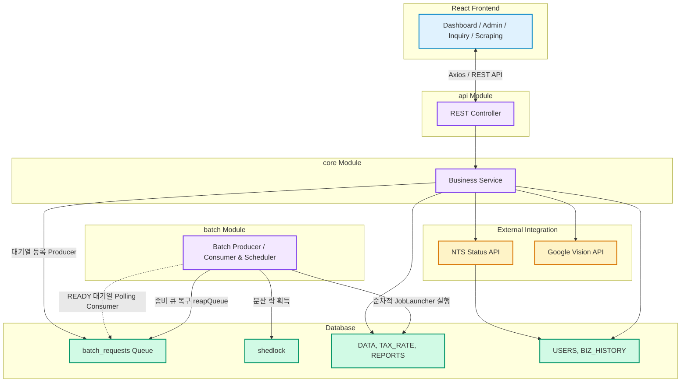
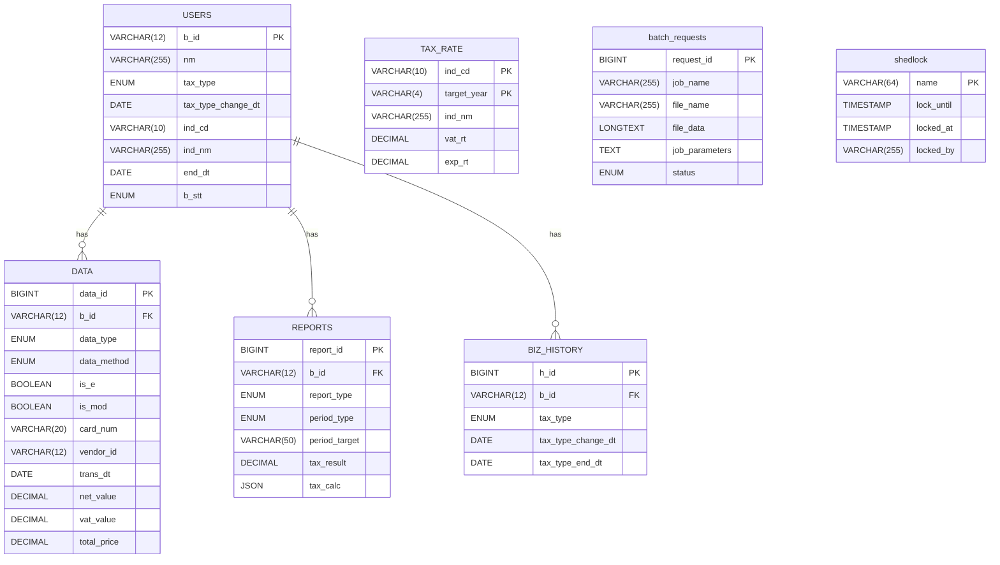

# BizReport - 소상공인 맞춤형 세금 예측 리포트

> **"복잡한 세무 지식을 코드로 추상화하여, 소상공인의 세금 불안을 해소합니다."** 
> <br/>
> 실무 경험을 바탕으로 기획/개발한 Full-Stack 시스템입니다.

<br/>

[BizReport 세무 도메인 가이드 보러가기](https://github.com/solkim7612/BizReport/wiki/Domain-Knowledge)
<br/>

---

## 1. Project Overview
- **기획 배경:** 소상공인들은 매일 발생하는 결제 데이터 속에서 실시간 예상 부가세와 종합소득세를 파악하기 어려움
- **핵심 목표:** 
  - Full-Stack 구성: React 기반의 직관적인 UI와 Spring Boot 멀티 모듈 백엔드 연동 
  - 멀티 모듈 구조: API, Core, Batch 모듈 분리를 통한 관심사 분리 및 확장성 확보 
  - 안정한 대용량 처리: DB 기반 큐(Producer-Consumer 패턴)와 순차적 JobLauncher 파이프라인을 통한 꼬임 없는 비동기 처리 
  - 데이터 정합성 & 신뢰성: 무중단 스왑(Staging Table), 멱등성 보장, 선분 이력 관리(SCD Type 2), 좀비 큐 자동 롤백(reapQueue) 구현

<br/>

---

## 2. Tech Stack
- Backend Language & Framework: Java 17, Spring Boot 3.2.4
- Architecture: Gradle Multi-Module (:api, :batch, :core)
- Frontend: React, React Router, Axios, Recharts, React-Toastify
- Data Access: Spring Data JPA, Querydsl 5.0, Spring JDBC (Bulk Upsert)
- Batch Processing: Spring Batch 5, ShedLock (Distributed Lock), Producer-Consumer Queue
- Database & Migration: MySQL 8.0, Flyway
- External API & OCR: Google Cloud Vision API (영수증 OCR 추출), 공공데이터포털(NTS) 사업자 상태 조회 API

<br/>

---

## 3. System Architecture



<br/>

---

## 4. ERD



<br/>

---

## 5. 주요 기능 및 기술적 의사결정
### 5.1. 프로듀서-컨슈머(Producer-Consumer) 기반 비동기 배치 파이프라인
- 기술: Producer-Consumer 패턴
- 근거 
  - 대용량 파일 업로드나 리포트 생성 작업을 동기/비동기 쓰레드로 무분별하게 병렬 실행할 경우, Spring Batch 메타 테이블(JobRepository 등) 락 경합 및 DB 데드락이 발생
  - Producer 영역에서 작업을 batch_requests 테이블에 READY 상태의 티켓으로 발행하고, Consumer 영역에서 1분 주기 스케줄러로 순차 폴링하여 실행하도록 아키텍처를 개선
  - 서버 다운이나 비정상 종료로 인해 PROCESSING 상태에 멈춰있는 "좀비 큐"를 1시간 기준으로 자동 롤백하는 reapQueue() 로직과, 멀티노드 환경 중복 실행을 막는 ShedLock을 결합하여 큐 안정성 확보

### 5.2. 무중단 데이터 교체 (Zero-Downtime Swap)
- 기술: Dynamic Staging Table 패턴
- 근거
  - 원본 데이터를 직접 조작 시 데이터 유실 위험이 크며, 작업 도중 사용자의 실시간 조회에 락(Lock) 간섭 발생
  - 동적 임시 테이블에 데이터 선적재 후, 단일 트랜잭션 내에서 원본 테이블 삭제 및 삽입을 수행하여 원자성을 확보하고 적재 중에도 무중단 조회 환경 구축

### 5.3. 고성능 Bulk 작업과 멱등성 보장
- 기술: JdbcBatchItemWriter & ON DUPLICATE KEY UPDATE
- 근거
  - 대용량 데이터 적재 시 JPA 영속성 컨텍스트를 사용할 경우 메모리 오버헤드와 다량의 개별 Insert 쿼리로 인한 성능 저하 발생
  - Spring JDBC 기반의 Bulk 연산을 통해 처리 속도를 극대화하고, ON DUPLICATE KEY UPDATE 전략을 통해 재실행 시 발생하는 PK 중복 및 멱등성 문제 해결

### 5.4. 시점 추적을 위한 이력 관리 (SCD Type 2)
- 기술: Effective Date Tracking (tax_type_change_dt ~ tax_type_end_dt)
- 근거
  - 기존 레코드를 Update 방식은 과거의 과세유형(일반/간이)를 소실시켜, 소급 세액 계산이나 특정 시점 데이터 추적이 불가능함
  - BIZ_HISTORY 테이블을 활용하여 변경 이력을 분리 관리하고 유효기간을 설정함으로써, 과거 특정 시점의 세무 상태를 소급하여 정확히 재계산할 수 있는 도메인 무결성을 확보 
  - 부가세 신고 기한이 지난 매입 자료 적재 시, 부가세 공제는 배제하고 부가세를 포함한 전체 공급대가를 매입액으로 자동 인식하도록 보정 로직 구현

<br/>

---

## 6. Out of Scope (구현 제외 범위)
- **면세사업자 대상 로직 제외:** 부가세 과세사업자(일반/간이)의 세금 예측 파이프라인에 개발 역량을 집중하여 도메인 복잡도를 낮춤
- **상세 세액 공제/감면 특례 적용 제외:** 표준 세액 계산 및 대용량 배치 처리 코어 비즈니스 로직에 집중
- **공인인증서 기반 스크래핑 제외:** 세무 계산 알고리즘의 정확성 검증에 집중하기 위해 민감인증서 연동 배제

<br/>

---

## 7. API Documentation
```text
BizReport/
└── docs/               
    └── postman/
        └── BizReport_API_Collection.json
```

| 분류 | 기능                    | Method | URL                                   | 설명                                 |
| :--- |:----------------------|:-------|:--------------------------------------|:-----------------------------------|
| Business | 사업자 등록                | POST   | /api/v1/business                      | 로그인 사업자 등록                         |
| Business | 사업자 등록 확인             | GET    | /api/v1/business/check/{id}           | 로그인 사업자 등록 확인                      |
| Business | 사업자 정보 조회             | GET    | /api/v1/business/{id}                 |                                    |
| Business | 사업자 정보 수정             | PATCH  | /api/v1/business/{id}                 |                                    |
| Business | 리포트 갱신권 충전            | PATCH  | /api/v1/business/charge/refresh       |                                    |
| Business | 사업자 정보 변경이력 조회        | GET    | /api/v1/business/history/biz/{id}     |                                    |
| Business | 갱신권 변경이력 조회           | GET    | /api/v1/business/history/refresh/{id} |                                    |
| Business | 업종명 기반 검색             | GET    | /api/v1/business/search/indNm         | 업종명을 키워드로 업종코드 조회                  |
| Business | 업종코드 기반 검색            | GET    | /api/v1/business/search/indCd         | 업종코드를 키워드로 업종명 검색                  |
| Business | 업종별 세율 업로드            | POST   | /api/v1/business/upload/rate          | 국세청의 기준(단순)경비율 파일 업로드              |
| Data | 세무 데이터 조회             | GET    | /api/v1/data/{id}                     |                                    |
| Data | 세무 데이터 추가             | POST   | /api/v1/data/{id}                     |                                    |
| Data | 영수증 텍스트 추출            | POST   | /api/v1/data/extract/text/{id}        | Google Cloud Vision 기반 이미지 분석      |
| Data | 세무 데이터 수정             | PATCH  | /api/v1/data/{id}/{dataId}            |                                    |
| Data | 세무 데이터 삭제             | DELETE | /api/v1/data/{id}/{dataId}            |                                    |
| Data | 더미 데이터 생성             | POST   | /api/v1/data/generate/mock/{id}       | 홈택스 스크래핑 대체 테스트 API                |
| Data | 업로드 양식 다운로드           | GET    | /api/v1/data/download/format          | CSV 샘플 포맷 다운로드                     |
| Data | 카드 내역 업로드             | POST   | /api/v1/data/upload/card/{id}         | CSV 파일 파싱 배치 대기열 등록                |
| Report | 리포트 조회                | GET    | /api/v1/reports/get/{id}              |                                    |
| Report | 리포트 수정                | PATCH  | /api/v1/reports/update/{id}           | 기납부세액 수동 조정 반영                     |
| Report | 리포트 갱신                | POST   | /api/v1/reports/refresh/{id}          | 갱신권을 소모하여 최신 리포트 재생성               |
| Report | 기납부세액 조회              | GET    | /api/v1/reports/prepaid-tax/{id}      | 직전연도 산출세액 기반 기납부세액 계산              |
| Batch | job 등록1 (사업자 정보 업데이트) | POST   | /api/v1/batch/job/statusUpdateJob     | 국세청 사업자 상태 조회 API를 이용한 사업자 정보 업데이트 |
| Batch | job 등록2 (사업자 상태 마감)   | POST   | /api/v1/batch/job/statusClosedJob     | 폐업일이 지난 사업자 상태 폐업으로 변경             |
| Batch | job 등록3 (리포트 생성)      | POST   | /api/v1/batch/job/reportCreateJob     | 월간/누적 리포트 생성                       |
| Batch | job 등록4 (지난 세율 삭제)    | POST   | /api/v1/batch/job/rateDeleteJob       | 5년 이상 지난 세율 정리                     |
| Batch | job 등록5 (세무 데이터 마감)   | POST   | /api/v1/batch/job/dataClosedJob       | 마감기한 지난 세무 데이터 마감                  |
| Batch | 캐시 초기화                | POST   | /api/v1/batch/cache                   | 세율 및 업종명 메모리 캐시 초기화                |
| Batch | 좀비 큐 롤백               | POST   | /api/v1/batch/queue/reap              | 1시간 이상 멈춘 좀비 큐 READY 복구            |
| Batch | 배치 대기열 상태 조회          | GET    | /api/v1/batch/queue/{id}              | 카드 업로드 배치 진행 현황                    |
| Batch | 배치 대기열 상태 조회          | GET    | /api/v1/batch/queue/detail/{batchId}  | 대기열에 등록된 카드 내역 데이터 확인              |
| Batch | 배치 대기열 상태 조회          | GET    | /api/v1/batch/queue                   | 전체 배치 작업 현황                        |


<br/>

---

## 8. Troubleshooting
### 8.1. 대용량 카드 내역 업로드 성능 및 안정성 확보
사용자가 동일한 기간의 같은 카드 내역을 재업로드할 때 발생하는 데이터 중복 문제를 해결하는 과정에서, 시스템 안정성과 데이터 무결성을 보장하기 위해 아키텍처를 3단계에 걸쳐 고도화

- Phase 1. DB 유니크 키 제약 조건 (도입 보류)
  - 접근 1: 유니크 키1 (카드번호+결제일+사업자번호+결제금액)
  - 접근 2: 유니크 키2 (카드 승인 번호)
  - 한계: 유니크 키1 사용 시 중복 데이터가 발생함을 발견하여, 유니크 키2를 도입하고자 했으나 카드사마다 승인 번호 존재 여부 차이가 있음
- Phase 2. 원본 데이터 직접 삭제 및 삽입 (데이터 유실 위험 발견)
  - 접근: 카드번호와 조회 기간을 파라미터로 받아, 해당 범위의 기존 데이터를 직접 삭제한 후 새 데이터를 삽입하는 덮어쓰기 방식으로 변경
  - 한계: 원본 데이터 삭제 후 새 데이터 적재 방식은 삭제와 삽입 사이의 공백에서 데이터 유실 위험이 존재함을 식별
- Phase 3. 동적 임시 테이블 패턴 (최종 해결)
  - 해결: 데이터 유실을 원천 차단하고 원자성을 보장하기 위해 Staging 패턴을 도입
    1. 사용자 ID별 격리된 임시 테이블 생성
    2. 데이터를 원본 테이블이 아닌 임시 테이블에 안전하게 모두 적재
    3. 단일 트랜잭션 내에서 원본 테이블과 안전하게 swap 하여 원자성을 보장
  - 성과: 업로드 도중 어떤 장애가 발생하더라도 원본 DATA 테이블은 전혀 타격을 받지 않으며, 사용자는 덮어쓰기 작업 중에도 기존 데이터로 안전하게 세금 리포트를 조회할 수 있는 무중단 환경을 구축

### 8.2. 세무 데이터 단일 원천 고도화 및 과세유형 전환대응
사업자 과세유형 (일반/간이) 전환 시 발생하는 데이터 마이그레이션 비용을 제거하고, 과거 시점의 세무 상태를 정확히 추적하기 위해 '단일 데이터 엔티티'와 '선분 이력 관리'를 결합한 아키텍처를 3단계에 걸쳐 고도화

- Phase 1. 다중 데이터 구조 (도입 보류)
  - 접근: 일반과세용과 간이과세용 데이터를 별도 엔티티로 관리
  - 한계: 과세유형 전환 시 방대한 과거 데이터 마이그레이션이 필수적이며, 시스템 유지보수 비용과 복잡도가 급격히 증가함
- Phase 2. 단일 데이터 엔티티 전환 (이슈 발견)
  - 접근: 모든 과세유형이 공통된 DATA 엔티티를 사용하도록 통합
  - 한계: 과세유형별 세율 적용 시점이나 부가세 신고 기한 경과에 따른 매입액 인식 로직이 충돌함
- Phase 3. 이력 관리 (BizHistory) 및 로직 기반 매입액 보정 (ignoreVat) 도입 (최종 해결)
  - 해결 1 (이력 관리): BizHistory 엔티티를 도입하여 사업자의 과세유형 변경 이력을 SCD Type 2 방식으로 관리하여, 특정 시점의 과세유형을 추적하여 세율을 정확히 재계산하는 로직 확보
  - 해결 2 (로직 기반 매입액 보정): ignoreVat 로직을 도입하여, 부가세 신고 기한이 지난 매입 자료 적재 시 부가세 공제는 배제하고 부가세를 포함한 전체 공급대가를 매입액으로 인식하도록 로직 수정
  - 성과: 데이터 구조 변경 없이 과세유형 전환 시점의 유연한 대응과 세무 기한별 매입액 인식의 정확성을 동시에 달성

### 8.3. Batch 비동기 스레드 실행 시 DB Deadlock 및 JobRepository 트랜잭션 충돌
- Phase 1. 
  
<br/>

---

<br/>

---

## 9. 기술적 고찰 및 향후 개선 과제
### 9.1. 인프라 계층의 탄력적 확장성
- Amazon S3 기반의 스토리지 외부화: 서버 로컬 파일 시스템에 존재하는 리소스를 S3로 이관하여 스케일아웃 시 파일유실/공유 문제 해결
- Kubernetes(K8s) 마이그레이션: Docker Compose 환경을 K8s로 전환하고 HPA(Horizontal Pod Autoscaler)를 적용하여 배치 집중 시간대 탄력적 자원 확장

### 9.2. 데이터 처리 엔진의 고성능화
- Message Queue 도입: DB Polling 방식에서 Apache Kafka 등으로 전환하여 비동기 이벤트 스트리밍 처리량 최적화
- 읽기/쓰기 분리 (CQRS 패턴 적용): 쓰기 중심 RDBMS와 읽기 최적화 저장소(Read Replica/Redis) 분리
- Database Partitioning: 시계열 DATA 테이블 연도별/분기별 파티셔닝 적용으로 인덱스 효율 극대화

### 9.3. 관측 가능성 및 장애 대응 강화
- 분산 트레이싱 환경 구축: Jaeger와 같은 오픈 트레이싱 도구를 도입하여 모듈 간 요청 흐름 시각화
- 통합 모니터링 체계: Prometheus & Grafana를 활용한 실시간 메트릭 및 알람 체계 구축

<br/>

---
