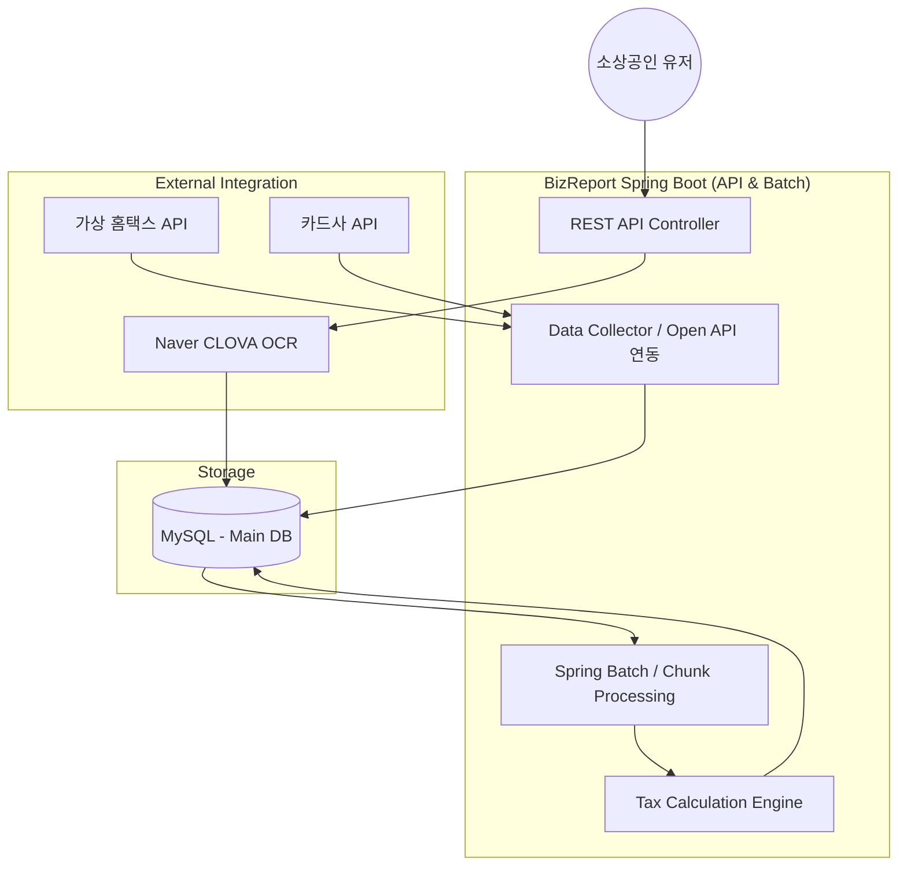
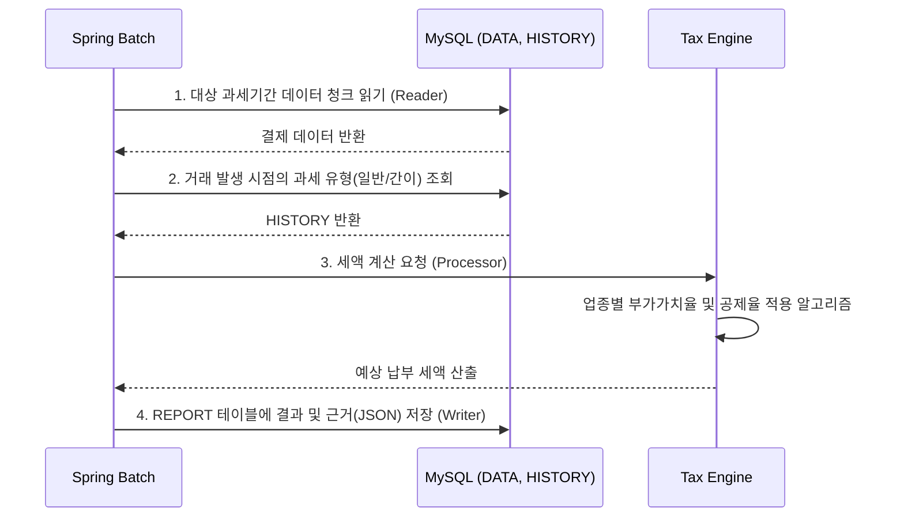

# BizReport - 소상공인 맞춤형 자동 기장 및 세금 예측 시스템

> **"복잡한 세무 지식을 코드로 추상화하여, 소상공인의 세금 불안을 해소합니다."** 
>  
> 실무 경험을 바탕으로 기획/개발한 백엔드 시스템입니다.

 

## 1. Project Overview
- **기획 배경:** 소상공인들은 매일 발생하는 결제 데이터 속에서 당월 예상 부가세와 종합소득세를 파악하기 어렵습니다.
- **핵심 목표:** 가상의 외부 API(홈택스, 카드사)에서 수만 명의 대용량 거래 데이터를 수집 및 정제하고, 매일 새벽 배치를 통해 세금 리포트를 자동 생성합니다. OCR 기술을 연동하여 영수증 수기 입력의 번거로움을 최소화합니다.

 

## 2. Tech Stack
- **Language:** Java 17
- **Framework:** Spring Boot 3.2.4
- **Data Access:** Spring Data JPA, Querydsl 5.0
- **Batch Processing:** Spring Batch 5
- **Database:** MySQL 8.0, H2 (Test)
- **Monitoring & API:** Jaeger (Distributed Tracing), Swagger (OpenAPI 3.0)
- **Infra:** Docker & Docker Compose

 

## 3. System Architecture

 

## 4. Core Features
### 4.1. 주요 도메인 기능
- 사업자 진위 확인 및 이력 관리: 공공데이터 API를 활용해 분기마다 사업자 상태를 동기화하고, 과세 유형(일반/간이) 변경 시 BIZ_HISTORY 테이블에 이력을 안전하게 적재합니다.
- 영수증 AI 자동 기장: 사용자가 업로드한 영수증 이미지를 비동기로 OCR 분석하여 DATA 테이블에 적재합니다.
- 대용량 세금 리포트 생성 배치: 매일 새벽 3시, 수만 건의 거래 데이터를 Chunk 단위로 읽어 부가세/종소세를 계산합니다.
### 4.2. Process Flow

### 4.3. Out of Scope (구현 제외 범위)
- **면세사업자 대상 로직 제외:** 부가세 과세사업자(일반/간이)의 세금 예측 파이프라인에 개발 역량을 집중
- **성실신고대상자 및 복식부기 의무자 제외:** 매출 규모가 작은 영세/소규모 소상공인을 핵심 타겟으로 설정
- **상세 세액 공제/감면 특례 적용 제외:** 코어 비즈니스 로직(표준 세액 계산 및 대용량 배치 처리) 검증에 집중
- **실제 공인인증서를 통한 홈택스 스크래핑 제외:** 가상의 오픈 API(Mock 데이터) 연동으로 대체하여 인프라 종속성 탈피

 

## 5. Troubleshooting
- 추가예정

 

## 6. API Documentation
- 추가예정

 

## 7. Testing
- 추가예정
