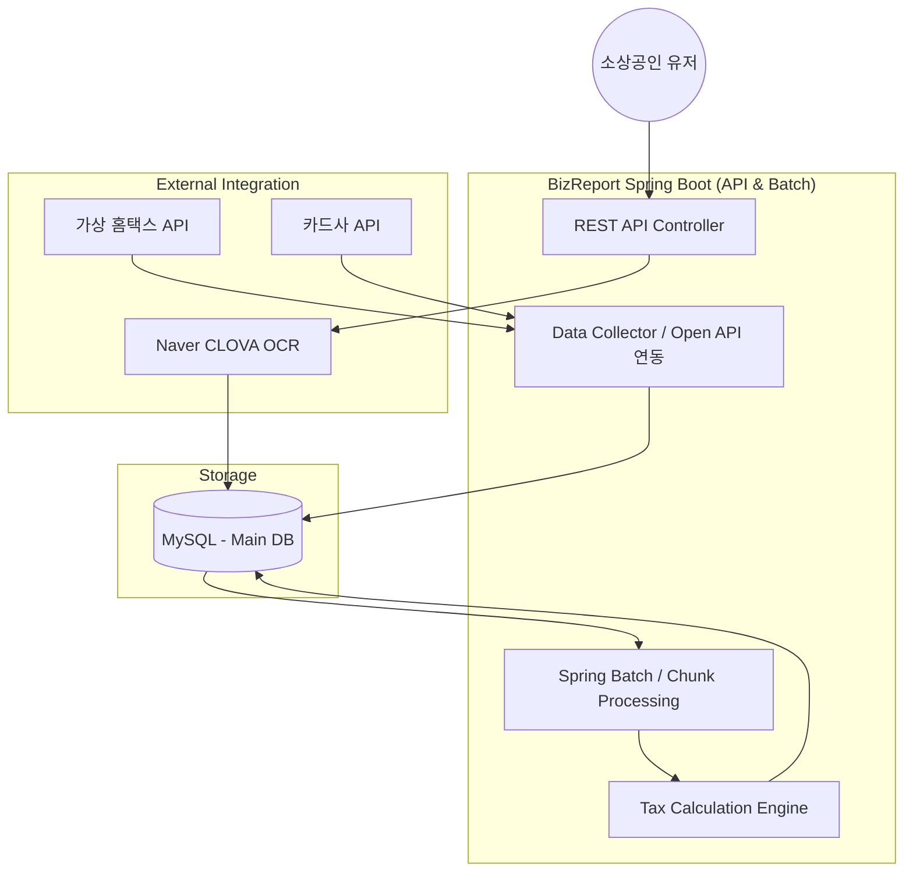
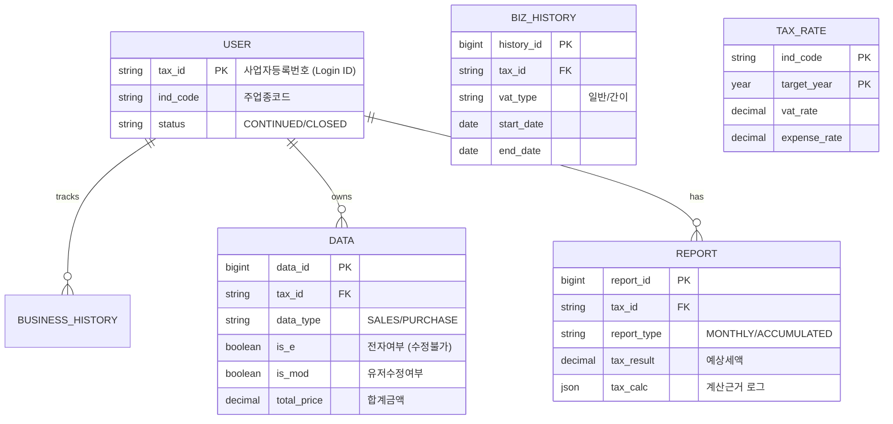
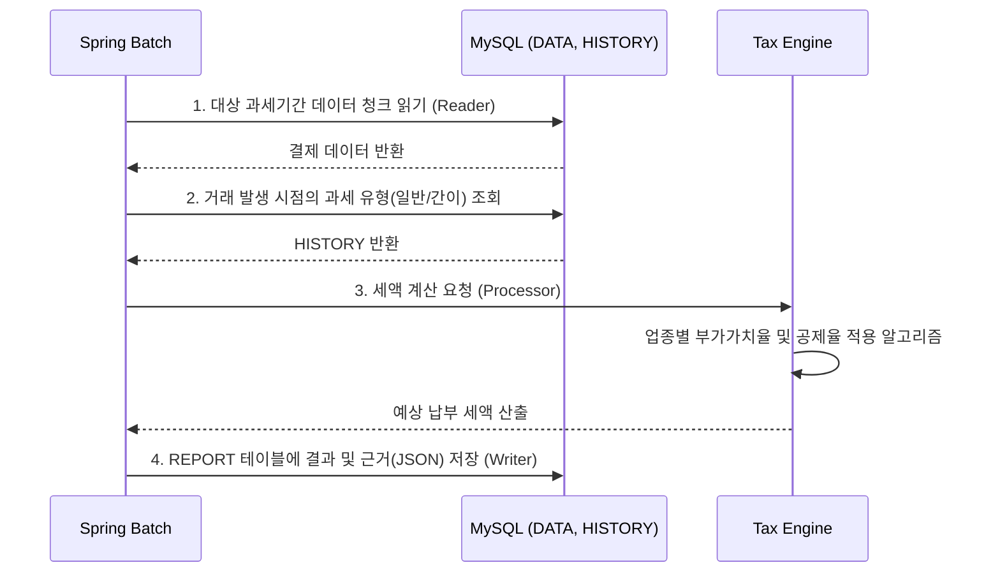

# BizReport - 소상공인 맞춤형 자동 기장 및 세금 예측 시스템

> **"복잡한 세무 지식을 코드로 추상화하여, 소상공인의 세금 불안을 해소합니다."**
 
> 실무 경험을 바탕으로 기획/개발한 백엔드 시스템입니다.

 

## 1. Project Overview
- **기획 배경:** 소상공인들은 매일 발생하는 결제 데이터 속에서 당월 예상 부가세와 종합소득세를 파악하기 어렵습니다.
- **핵심 목표:** 가상의 외부 API(홈택스, 카드사)에서 수만 명의 대용량 거래 데이터를 수집 및 정제하고, 매일 새벽 배치를 통해 세금 리포트를 자동 생성합니다. OCR 기술을 연동하여 영수증 수기 입력의 번거로움을 최소화합니다.

 

## 2. Tech Stack
- **Language:** Java 17
- **Framework:** Spring Boot 3.2.4
- **Data Access:** Spring Data JPA, Querydsl 5.0
- **Batch Processing:** Spring Batch 5
- **Database:** MySQL 8.0, H2 (Test)
- **Monitoring & API:** Jaeger (Distributed Tracing), Swagger (OpenAPI 3.0)
- **Infra:** Docker & Docker Compose

 

## 3. System Architecture

 

## 4. Database Design
- 과세 유형 변경(일반/간이) 이력 추적과 사용자 데이터 무결성을 보장하기 위해 정규화된 설계를 적용했습니다.

 

## 5. Core Features
### 5.1. 주요 도메인 기능
- 사업자 진위 확인 및 이력 관리: 공공데이터 API를 활용해 1,4,7,10,12월 1일마다 사업자 상태를 동기화하고, 과세 유형(일반/간이) 변경 시 BUSINESS_HISTORY 테이블에 이력을 안전하게 적재합니다.
- 영수증 AI 자동 기장: 사용자가 업로드한 영수증 이미지를 비동기로 OCR 분석하여 DATA 테이블에 적재합니다.
- 대용량 세금 리포트 생성 배치: 매일 새벽 3시, 수만 건의 거래 데이터를 Chunk 단위로 읽어 부가세/종소세를 계산합니다.
### 5.2. Process Flow

### 5.3. Out of Scope
- 성실신고대상자 및 복식부기 의무자 대상 로직 제외 (소규모 소상공인 타겟)
- 상세한 세액 공제/감면 특례 적용 제외 (핵심 로직 검증에 집중)
- 실제 공인인증서를 통한 홈택스 스크래핑 (가상 Mock 데이터 API로 대체)

## 6. Tax Calculation Logic
### 6.1. 부가가치세
- 일반과세자: (매출액 * 10%) - (매입액 * 10%) - 기납부세액
- 간이과세자: (매출액 * 업종별부가가치율 * 10%) - (매입액 * 0.5%) - 기납부세액
### 6.2. 종합소득세(단순경비율)
- 소득금액 = 수입금액 - (수입금액 * 단순경비율)
- 산출세액 = (소득금액 - 1,500,000) * 누진세율 - 누진공제

## 7. Troubleshooting
- 추가예정

## 8. API Documentation
- 추가예정

## 9. Testing
- 추가예정
