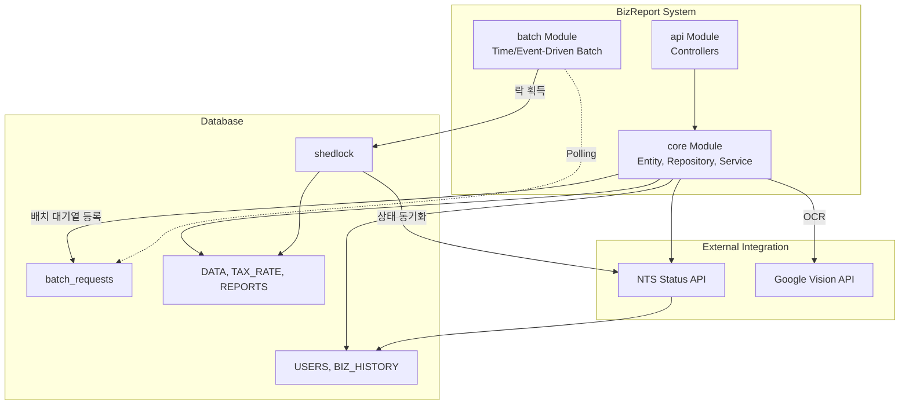
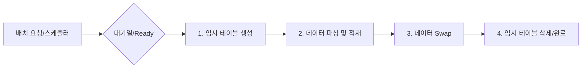

# BizReport - 소상공인 맞춤형 세금 예측 리포트

> **"복잡한 세무 지식을 코드로 추상화하여, 소상공인의 세금 불안을 해소합니다."** 
>  
> 실무 경험을 바탕으로 기획/개발한 백엔드 시스템입니다.

 

---

## 1. Project Overview
- **기획 배경:** 소상공인들은 매일 발생하는 결제 데이터 속에서 실시간 예상 부가세와 종합소득세를 파악하기 어려움
- **핵심 목표:**
  - 멀티 모듈 구조: 모듈 분리를 통한 관심사 분리 및 확장성 확보 
  - 안정한 대용량 처리: 비동기 대기열 및 스케줄링 기반의 정교한 배치 파이프라인 구현 
  - 데이터 정합성: 무중단 스왑, 멱등성 보장, 선분 이력 관리를 통해 세무 데이터 신뢰성 확보

 

---

## 2. Tech Stack
- **Language:** Java 17
- **Framework:** Spring Boot 3.2.4
- **Architecture**: Gradle Multi-Module (:api, :batch, :core)
- **Data Access:** Spring Data JPA, Querydsl 5.0, Spring JDBC (Bulk)
- **Batch Processing:** Spring Batch 5, ShedLock
- **Database:** MySQL 8.0
- **Infra:** Docker

 

---

## 3. System Architecture

 

---

## 4. Batch Architecture
### 4.1. Event-Driven vs Time-Driven 스케줄링 분리

// todo: mermaid에 아래 내용 반영
- Time-Driven (예약형 배치): 지난 세율 데이터 삭제, 사업자 상태 업데이트 및 폐업 변경, 신고마감기한 지난 데이터 마감, 월별 및 누적 리포트 생성
- Event-Driven (요청형 비동기 배치): 카드내역 파일 업로드, 세율 파일 업로드

### 4.2. 장애 복구 및 무중단 파이프라인
- 좀비 리퍼(Zombie Reaper): 서버 크래시로 멈춘 PROCESSING 배치를 감지하여 READY 롤백
- 무중단 스왑(Zero-Downtime Swap): 동적 임시 테이블을 활용하여 원본 데이터 삭제와 새 데이터 삽입을 트랜잭션 내에서 처리

 

---

## 5. Business Logic
### 5.1. 단일 데이터 원천
- 세금 종류(부가세, 소득세)별로 데이터를 중복 적재하지 않고, 동일한 DATA 엔티티를 공유
- 인터페이스를 통한 전략 패턴을 적용하여 같은 데이터를 읽어 서로 다른 산출 로직(과세유형, 신고타입)을 적용

### 5.2. 멱등성 보장 및 리포트 마감 시스템
- 산출된 세금 리포트는 ON DUPLICATE KEY UPDATE를 활용한 Bulk Upsert로 DB에 적재되어, 배치를 여러 번 재실행해도 멱등성(Idempotency)이 보장
- 리포트는 법정 마감 기한 전까지는 지속적으로 재계산 및 업데이트가 가능하며, 기한이 지난 후에는 수정이 불가능하도록 상태를 잠금(Lock) 처리
- 복잡한 세금 계산 근거는 정규화로 인한 조인(Join) 성능 저하를 막기 위해 JSON 컬럼(tax_calc)으로 직렬화하여 저장

### 5.3. 선분 이력을 통한 상태 관리 (SCD Type 2)
- 사업자의 과세유형(일반/간이) 또는 영업상태가 변경될 경우, 기존 레코드를 UPDATE하지 않고 BIZ_HISTORY 테이블에 새로운 이력을 INSERT
- 기존 이력의 tax_type_end_dt를 닫아주고 새로운 이력을 9999-12-31로 활성화하는 SCD(Slowly Changing Dimension) Type 2 방식을 적용하여, 과거 특정 시점의 과세유형과 세율을 정확히 추적

 

---

## 6. Out of Scope (구현 제외 범위)
- **면세사업자 대상 로직 제외:** 부가세 과세사업자(일반/간이)의 세금 예측 파이프라인에 개발 역량을 집중하여 도메인 복잡도를 낮춤
- **상세 세액 공제/감면 특례 적용 제외:** 코어 비즈니스 로직(표준 세액 계산 및 대용량 배치 처리) 검증에 집중하기 위해 잉여 복잡성을 배제
- **공인인증서 기반 스크래핑 제외:** 실제 외부 시스템(홈택스)의 불안정성 및 인프라 종속성을 탈피하기 위해 Mock 데이터 제너레이터(DataService.generate)로 대체 

 

---

## 7. Troubleshooting
### 7.1. 대용량 카드 내역 업로드 성능 및 안정성 확보
사용자가 동일한 기간의 같은 카드 내역을 재업로드할 때 발생하는 데이터 중복 문제를 해결하는 과정에서, 시스템 안정성과 데이터 무결성을 보장하기 위해 아키텍처를 3단계에 걸쳐 고도화했습니다.

- Phase 1. DB 유니크 키 제약 조건 (도입 보류)
  - 접근 1: 유니크 키1 (카드번호+결제일+사업자번호+결제금액)
  - 접근 2: 유니크 키2 (카드 승인 번호)
  - 한계: 유니크 키1 사용 시 중복 데이터가 발생함을 발견하여, 유니크 키2를 도입하고자 했으나 카드사마다 승인 번호 존재 여부 차이가 있음
- Phase 2. 원본 데이터 직접 삭제 및 삽입 (데이터 유실 위험 발견)
  - 접근: 카드번호와 조회 기간을 파라미터로 받아, 해당 범위의 기존 데이터를 직접 삭제한 후 새 데이터를 삽입하는 덮어쓰기 방식으로 변경
  - 한계: 원본 데이터 삭제 후 새 데이터 적재 방식은 삭제와 삽입 사이의 공백에서 데이터 유실 위험이 존재함을 식별
- Phase 3. 동적 임시 테이블 패턴 (최종 해결)
  - 해결: 데이터 유실을 원천 차단하고 원자성을 보장하기 위해 Staging 패턴을 도입
    1. 사용자 ID별 격리된 임시 테이블 생성
    2. 데이터를 원본 테이블이 아닌 임시 테이블에 안전하게 모두 적재
    3. 단일 트랜잭션 내에서 원본 테이블과 안전하게 swap 하여 원자성을 보장
  - 성과: 업로드 도중 어떤 장애가 발생하더라도 원본 DATA 테이블은 전혀 타격을 받지 않으며, 사용자는 덮어쓰기 작업 중에도 기존 데이터로 안전하게 세금 리포트를 조회할 수 있는 무중단 환경을 구축

### 7.2. 

 

---

## 8. API Documentation
| 분류 | 기능               | Method | URL | 설명                       |
| :--- |:-----------------| :--- | :--- |:-------------------------|
| Business | 사업자 등록           | POST | /api/v1/business | 신규 사업자 등록                |
| Business | 사업자 정보 수정        | PATCH | /api/v1/business/{id} | 기존 사업자 정보 변경             |
| Business | 업종별 세율 업로드       | POST | /api/v1/business/upload/rate | 배치 대기열에 등록               |
| Data | 영수증 텍스트 추출 (OCR) | POST | /api/v1/data/receipt/extract | 이미지 기반 세무 데이터 추출         |
| Data | 수기 데이터 생성        | POST | /api/v1/data | 개별 수기 세무 데이터 입력          |
| Data | 데이터 조회           | GET | /api/v1/data/{id} | 기간/유형별 세무 데이터 조회         |
| Data | 데이터 금액 수정        | PATCH | /api/v1/data/{id} | 수정 가능한 데이터 금액 변경         |
| Data | 데이터 삭제           | DELETE | /api/v1/data/{id} | 마감기한이 지나지 않은 데이터 삭제      |
| Data | 더미 데이터 생성        | POST | /api/v1/data/generate/mock | 홈택스 스크래핑 대체              |
| Data | 업로드 양식 다운로드      | GET | /api/v1/data/download/format | CSV 샘플 다운로드              |
| Data | 카드 내역 업로드        | POST | /api/v1/data/upload/card | 배치 대기열에 등록               |
| Report | 기간 리포트 생성        | POST | /api/v1/reports/batch/accumulated | 원하는 기간 리포트 생성 요청         |
| Report | 리포트 조회           | GET | /api/v1/reports/view/{id} | 월별/기간별 세금 리포트 조회         |
| Batch | 배치 대기열 시작        | POST | /api/v1/batch/queue/run | 대기 중인 배치 큐 즉시 실행         |
| Batch | 지난 세율 정리         | POST | /api/v1/batch/rate/delete | 5년 이상 지난 세율 데이터 삭제       |
| Batch | 사업자 상태 동기화       | POST | /api/v1/batch/status/update | 국세청 API 기반 사업자 상태 갱신     |
| Batch | 사업자 상태 폐업 전환     | POST | /api/v1/batch/status/closed | 폐업일이 지난 사업자 폐업 상태로 일괄 전환 |
| Batch | 데이터 마감           | POST | /api/v1/batch/data/closed | 신고 마감기한이 지난 세무 데이터 마감    |
| Batch | 월간 리포트 생성        | POST | /api/v1/batch/report/monthly | 당월 예상 세액 리포트 생성          |
| Batch | 기간 리포트 생성        | POST | /api/v1/batch/report/accumulated | 분기별 누적 예상 세액 리포트 생성      |
| Batch | 캐시 초기화           | POST | /api/v1/batch/cache/clear | 업종명 및 세율 캐시 초기화          |

 

---

## 9. Testing
- 단위 테스트: 각 모듈별 도메인 로직을 JUnit 5와 Mockito로 검증
- 배치 통합 테스트: H2/MySQL 환경에서 대량 데이터 적재 시 COMPLETED 상태 및 멱등성 검증
- 부하 테스트: 50,000건 이상의 더미 데이터 환경에서 쿼리 최적화 및 API 응답 속도 확인
